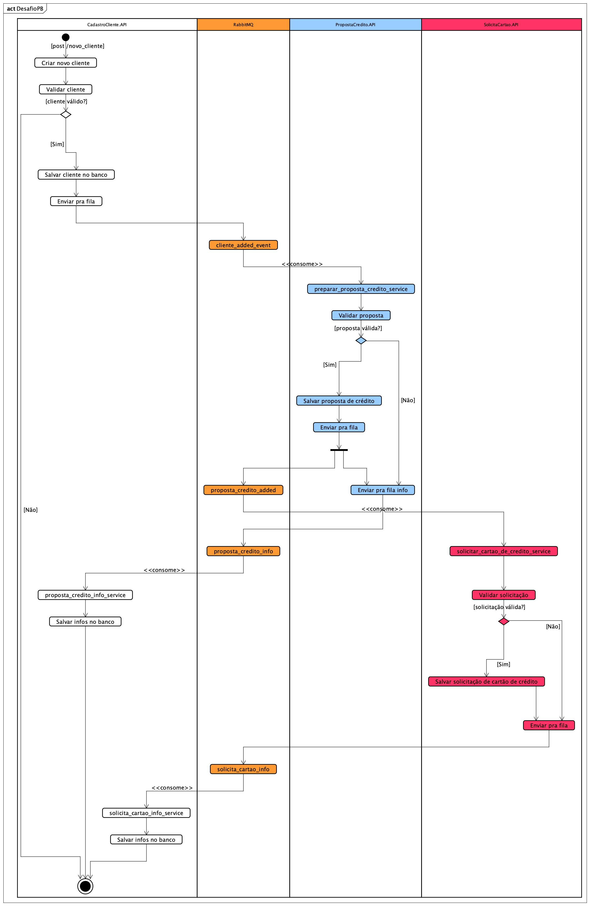
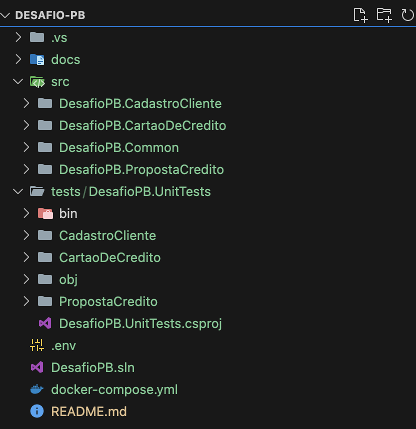
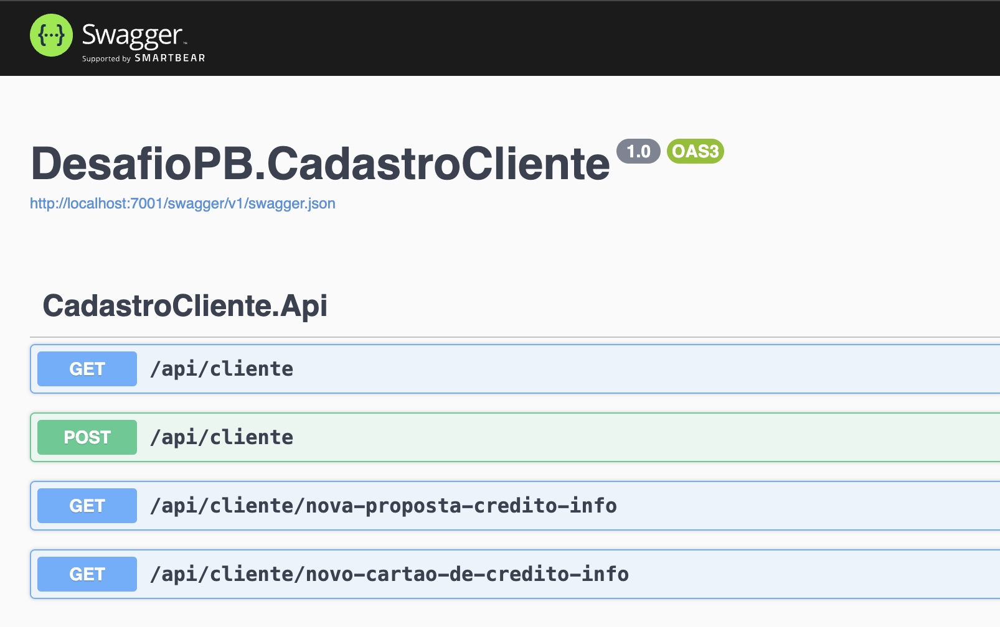
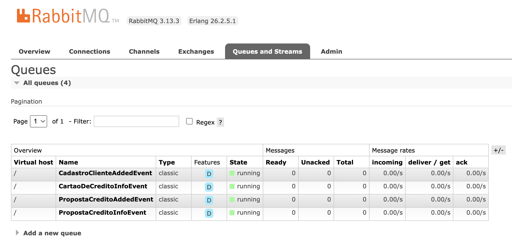

# Business Case PB Tech

Este documento apresenta uma proposta e prova de conceito de uma arquitetura baseada em microserviços e mensageria. A arquitetura envolve três microserviços principais: Cadastro de Clientes, Proposta de Crédito e Cartão de Crédito. Fora utilizada a ferramenta de mensageria **RabbitMQ**, o framework **.NET 8.0** para o desenvolvimento dos microserviços, **Docker** para deploy do ambiente e **Astah** para a criação dos diagramas. Antes de iniciar o projeto e desenvolvimento dessa proposta, foram assumidos os seguintes itens:

* Durante a análise dos requisitos da arquitetura, foi entendido que o serviço de Emissão de Cartão de Crédito só poderá ser chamado após aprovada uma Proposta de Crédito para o cliente, ou seja, após o processo bem sucedido de aprovação de proposta de crédito, o serviço de emissão do cartão é invocado via mensageria.
* As API's não foram criadas pensando na segurança de acesso, os *endpoints* estão livres (*AllowAnonymous*)
* Foi utilizado um banco de dados em memória nas API's, fornecido pelo *Entity Framework* (*Microsoft.EntityFrameworkCore.InMemory*).
* Sempre que houver uma falha de comunicação entre as filas e os microserviços, estes foram implementados para ficar tentando reconectar infinitamente (*RetryForever*).

## Arquitetura Proposta

Segue abaixo o diagrama de atividades da arquitetura proposta nesse case.



## Estrura do Projeto

Além da proposta, foi implementada uma prova de conceito com o objetivo de validar o funcionamento e identificar possíveis melhorias. Tal implementação foi feita utilizando algumas práticas de organização de projetos do mercado:

* Arquitetura Hexagonal
* Eventos
* Notificações
* Validations
* CQRS (Imediate Consistency)
* Retry Pattern
* Unit Tests

A solution foi organizada em 5 projetos, 3 deles são os dos microserviços, 1 de testes unitários e outro com as implementações comuns. A figura abaixo mostra a estrutura de pastas.



## Execução local com VS/VS Code e Docker

Para executar o projeto localmente você irá precisar:

- Docker e docker-compose
- Acesso a internet

Primeiramente, você precisa clonar esse projeto. Após isso, entre na pasta do projeto, no mesmo diretório onde está localizado o arquito *docker-compose.yml* e execute os comandos abaixo:

```
docker-compose build
```

depois:

```
docker-compose up -d
```

Após isso, acesso o link *http://localhost:7001/swagger/index.html*, essa é a página da API de Clientes.



Os dois endpoints de *nova-proposta-credito-info* e *novo-cartao-de-credito-info* são alimentados pelas informações geradas nos microserviçoes de proposta crédito e cartão de crédito, respectivamente. Caso alguma inconsistência aconteça com esses serviços, a API de clientes recebe o status via mensageria. Dessa forma, fica mais fácil tomar alguma decisão, como o reenvio da mensagem.

Na imagem abaixo têm-se as filas utilizadas no *RabbitMQ*. Cada microserviço têm duas filas, uma para eventos de adição de recursos (added_event), e outra para coleta de informações para a API de clientes (info_event).



## Considerações finais e melhorias

Como proposta de melhorias, pode-se destacar:

* Criar mecanismo de dead-lettering, caso uma mensagem falhar por várias vezes consecutivas.
* Melhorar o código dos eventos, adicionando genéricos para melhorar a reutilização de código.
* Criar mecanismo de controle de aceite (*ack*) manual das mensagens, permitindo que uma mensagem não saia da fila até ela ser processada corretamente.
* Implementar os padrões de projeto *Repository* e *UnityOfWork* na camada de acesso a banco de dados.

### Desde já, agradeço a oportunidade de participar deste processo seletivo.